# ARTEFATOS PARA TESTE DE MESA: <br> MODELOS, EXEMPLOS E EXERCÍCIOS

Nas disciplinas introdutórias de Algoritmos e Programação de Computadores, a resolução dos exercícios propostos deve envolver as seguintes etapas:
- Planejamento: projetar a solução, listando os dados de entrada, as etapas de processamento necessárias e os dados de saída, contemplando os componentes abstração, decomposição e reconhecimento de padrões do PC;
- Solução algorítmica: desenvolver o fluxograma e/ou pseudocódigo, buscando generalizar a partir de casos reais ou exemplos disponíveis (componentes generalização e algoritmos do PC);
- Testes: validar a solução, utilizando os artefatos disponibilizados (e, caso necessário, retomar as etapas anteriores para corrigir ou complementar a solução) (componente depuração do PC);
- Implementação: codificar a solução em uma linguagem de alto nível (C/C++).
 
Os estudantes são encorajados a desenvolver esse conjunto de passos (exceto a implementação) de forma manuscrita. A metodologia de atividade desplugada contribui para a disseminação dos artefatos, pois não exige recursos computacionais e possibilita que sejam utilizados desde o ensino médio/técnico até o superior, ou em atividades de ensino destinadas à disseminação dos conceitos de PC, algoritmos e programação.
Para cada tópico abordado, são disponibilizados exemplos, que constituem um referencial facilitador para o aprendizado, incluindo todas essas etapas (Exemplo 1, ilustrado abaixo). O uso de fluxogramas é muito adequado, pois trata-se de uma representação de mais alto nível, intuitiva à leitura, que permite a visualização dos fluxos de execução principalmente quanto às estruturas de seleção e repetição.

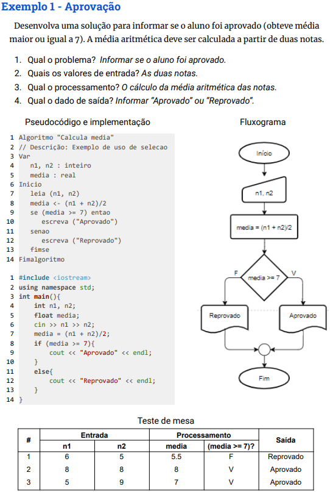

Para um teste de mesa, uma lista das variáveis e a atribuição dos valores aos longo do algoritmo é suficiente; é importante que o teste seja feito com mais de uma instância. Cada conjunto de dados (um exemplo concreto) de um teste define uma instância do problema. É importante avaliar especialmente o comportamento do algoritmo com os valores limites, conforme o contexto do problema.

Em um algoritmo, as variáveis constituem símbolos, assim como na notação matemática; no entanto, quando se considera que o algoritmo será traduzido para uma linguagem e executado por um computador, deve-se deixar claro que as variáveis representam posições de memória.

Uma representação adequada de um teste de mesa é por meio de uma tabela, organizada em quatro seções, conforme o título das colunas:
- #: o identificador de uma instância de teste;
- Entrada: as variáveis que são informadas pelo usuário quando da realização de uma instância de teste;
- Processamento: o conjunto das variáveis utilizadas no algoritmo (além das de entrada) e as  expressões lógicas (condições), quando há estruturas condicionais ou de repetição. As colunas das condições serão preenchidas com os valores lógicos, conforme as instâncias;
- Saída: as respostas do algoritmo, incluindo valores de variáveis e textos.

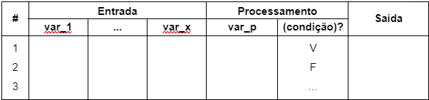
       
O funcionamento do algoritmo deve ser simulado linha-a-linha. Cada instrução deve refletir sua ação, alterando os valores das variáveis e assinalando o resultados das condições no teste de mesa.

## Teste de mesa de algoritmos sequenciais

Para listar as variáveis nas colunas, é aconselhável que sigam a ordem de ocorrência no pseudocódigo, facilitando o preenchimento.

O primeiro exemplo apresentado (Algoritmo Soma) pede a soma de dois valores numéricos, cuja solução consiste em uma instrução de entrada, uma expressão aritmética e uma instrução de saída. 

```
Algoritmo "Soma"
// Descrição: Soma dois valores numéricos inteiros
Var
  x, y, soma : inteiro
Inicio
  leia (x, y)
  soma <- x + y
  escreva (soma)
Fimalgoritmo
```

No teste de mesa (veja abaixo), a primeira coluna numera a instância de teste (coluna indicada por #). Depois, são representadas as variáveis `x` e `y`, explicitadas como valores de entrada, a variável `soma`, como variáveis envolvida no processamento, e a coluna Saída, em que são mostrados os valores da instrução de saída. Para cada instância (neste teste constam 4 instâncias), são atribuídos os valores para as variáveis de entrada a critério do estudante (instrução leia), realizado o cálculo, atribuindo o resultado à variável `soma` (instrução `soma <- x + y`) e mostrado o valor da variável `soma` na coluna Saída (conforme a instrução `escreva (soma)`). 

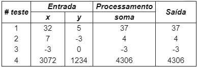

Quando há a sobreposição de valor em uma variável, isso deve ficar explícito no teste, sendo possível visualizar toda a evolução dos valores. Assim, os valores devem ser cortados com um traço (usa-se o efeito tachado nos exemplos editados digitalmente) e o novo valor é indicado ao lado. Essa situação pode ser vista no exemplo do Algoritmo Troca, que executa a troca de valores entre duas variáveis.

```
Algoritmo "Troca"
// Descrição: Troca de conteúdo de duas variáveis
Var
   a, b, aux : inteiro
Inicio
   leia (a, b)
   aux <- a
   a <- b
   b <- aux
   escreva (a, b)
Fimalgoritmo
```

No teste de mesa (abaixo), o conteúdo das variáveis `a` e `b` é substituído quando as instruções `a <- b` e `b <- aux` são executadas.

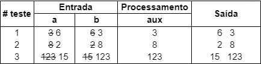

Outra situação que deve ser observada é com relação à inicialização de variáveis. Embora, no papel, as variáveis representadas estejam inicialmente vazias, após codificado o algoritmo (dependendo da linguagem utilizada), se as variáveis não tiverem sido inicializadas, um valor não conhecido poderá ser recuperado (lixo de memória) e resultar em erros de execução. Essa situação é ilustrada com um exercício, em que é pedida a descrição da funcionalidade do Algoritmo Inicializa.

```
Algoritmo "Inicializa"
// Descrição: Avalia inicializacao
   a, b, aux : inteiro
Inicio
   leia (a)
   a <- b
   leia (b)
   aux <- a
   b <- aux
   escreva (a, b)
Fimalgoritmo
```

Ao se depararem com a instrução `a <- b`, os aprendizes percebem que a variável `b` não tem valor e questionam o que acontece com o algoritmo e como devem proceder. Nesse caso, são estimulados a descrever que a variável não tinha valor atribuído e, portanto, não é possível saber quais valores serão mostrados.

## Teste de mesa de estruturas de seleção
Para fazer o teste de mesa de uma estrutura de seleção, cada condição deve constituir uma coluna da tabela, indicada entre parênteses e com um sinal de interrogação (conforme ilustrado abaixo). 
Por exemplo, `(a>b)?`, `(n%2=0)?`, `(mes<=12)?`. Quando a condição for longa, o cabeçalho da tabela pode indicar a linha de código da condição. Nos casos de teste, essas colunas recebem os valores da avaliação da condição para cada vez que a linha da condição for alcançada (V ou F). 


Em estruturas de seleção aninhadas, as condições que não são avaliadas devem ser assinaladas com um hífen, deixando claro que o fluxo de execução do algoritmo foi desviado antes dessa condição. Um exemplo simples é o Algoritmo "Maior de dois", com apenas uma estrutura aninhada. No teste de mesa, é possível ver na primeira instância a condição `(a < b)?` assinalada com hífen.

```
Algoritmo "Maior de dois"
// Descrição: Maior valor com estrutura de seleção aninhada
Var
   a, b : inteiro
Inicio
   leia (a, b)
   se (a > b) entao
      escreva ("A é maior")
   senao
      se (a < b) entao
         escreva ("B é maior")
      senao
         escreva ("A e B sao iguais")
      fimse
   fimse
Fimalgoritmo
```

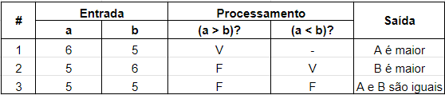

Para alguns problemas, é adequado um teste de mesa exaustivo, que consiste em explorar todos os fluxos de execução possíveis de um algoritmo. Como exemplo, considere o problema da ordenação de três valores numéricos. Para três valores, quais as combinações possíveis? Quais trocas são necessárias para ordenar cada um desses conjuntos? Uma solução é o Algoritmo Ordena. 
 
```
Algoritmo "Ordena"
// Descrição: Ordenacao de três valores usando estruturas de 
//            selecao alinhadas
Var
   a, b, c, aux : inteiro
Inicio
   leia (a, b, c)
   se (a > b) entao
      aux <- a
      a <- b
      b <- aux
   fimse
   se (b > c) entao
      aux <- b
      b <- c
      c <- aux
   fimse
   se (a > b) entao
      aux <- a
      a <- b
      b <- aux
   fimse
   escreva (a, b, c)
Fimalgoritmo
```

No teste abaixo, é possível verificar, nas colunas das condições, que todas as combinações possíveis foram testadas, garantindo a corretude do algoritmo.

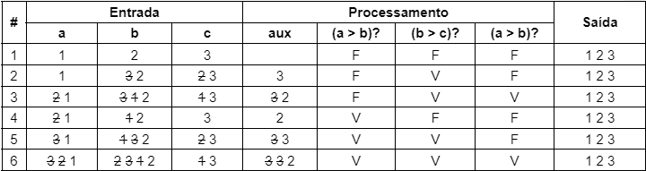

Para os algoritmos com estrutura de seleção múltipla (escolha-caso), cada caso deve ser considerado em uma coluna, explicitando a condição. O teste do Algoritmo Calculadora apresenta uma instância para cada caso da estrutura. Quando uma das condições é satisfeita, as demais não são avaliadas (indicado na coluna com um hífen). Na última instância, está representada a entrada não prevista em nenhum dos casos, em que é executada a cláusula `outrocaso`.  

```
Algoritmo "Calculadora"
// Descrição: Calculadora simples com estrutura de selecao multipla
var
   op : caractere
   a, b, r : real
inicio
   leia (op, a, b)
   escolha (op)
      caso "+"
           r <- a + b
      caso "-"
           r <- a - b
      caso "*"
           r <- a * b
      caso "/"
           r <- a / b
      outrocaso
           r <- 0
   fimescolha
   escreva (a, op, b, " = ", r)
fimalgoritmo
```

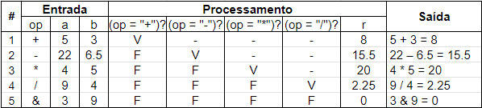

## Teste de mesa de estruturas de repetição
Para fazer o teste de mesa de algoritmos com estruturas de repetição, cada iteração será representada por uma linha. Nesses casos, cada instância ocupará várias linhas. Para ilustrar essa estrutura, considere o Algoritmo "Maior de N", que tem como objetivo encontrar o maior dentre N valores lidos. 

```
Algoritmo "Maior de N"
// Descrição: Identifica o maior dentre n valores lidos
Var
   n, x, maior, i : inteiro
Inicio
   maior <- 0
   leia (n)
   para i de 1 ate n passo 1 faca
      leia (x)
      se (x > maior) entao
         maior <- x
      fimse
   fimpara   
   escreva (maior)
Fimalgoritmo
```

Se o valor de uma variável é alterado, o novo valor deve constar na linha da iteração em que ocorre a atribuição.
O teste abaixo apresenta duas instâncias para o Algoritmo "Maior de N". Quando a condição de parada é atingida, a condição `(x > maior)?`, que é interna ao bloco da estrutura de repetição, não é avaliada e, portanto, assinalada com um hífen.

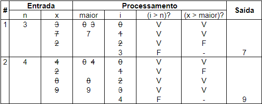

Como exemplo de estrutura de repetição pós-teste, considere o Algoritmo "Chico e Juca", uma solução para o problema: <br>
"Chico tem 1,50m e cresce 2 cm por ano, enquanto Juca tem 1,10m e cresce 3 cm por ano. <br>
Quantos anos serão necessários para que Juca seja maior que Chico?"

```
Algoritmo "Chico e Juca"
// Descrição: Calcula quantos anos são necessários para que 
//            Juca seja maior do que Chico
Var
   anos : inteiro
   Chico, Juca : real
Inicio
   Chico <- 1.50
   Juca < - 1.10
   anos <- 0
   repita 
      Chico <- Chico + 0.02
      Juca <- Juca + 0.03
      anos <- anos + 1
   ate Juca > Chico
   escreva (anos)
Fimalgoritmo
```

O longo teste de mesa foi suprimido (como indicado no teste abaixo pelas reticências), apresentando as primeiras e as últimas iterações. Outra peculiaridade deste algoritmo é que não há dado de entrada, portanto, apenas uma instância de teste é possível.

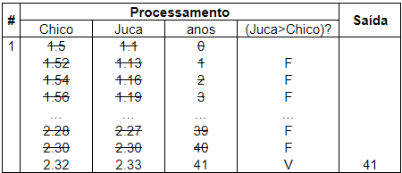

## Teste de mesa com vetores

Nos testes de mesa, os vetores devem ser representados posição a posição, seguindo a definição da estrutura (posições contíguas de memória com acesso direto a partir do índice). Como exemplo, considere o Algoritmo Dobro, que, a partir de um valor lido e armazenado na primeira posição, calcula o dobro e armazena nas posições subsequentes, preenchendo um vetor de tamanho 10 (cada posição tem o dobro da posição anterior). 

```
Algoritmo "Dobro"
// Descrição: A partir de um valor lido, calcula o dobro 
//            do valor e guarda em um vetor 
Var
   num, i : inteiro
   N : vetor [1 .. 10] de inteiro
Inicio
   leia (num)
   para i de 1 até 10 faca
        N[i] <- num
        num <- num * 2
        escreva ("N[", i, "]=", N[i])
   fimpara
Fimalgoritmo
```

No teste de mesa, pode-se observar a atribuição em cada posição do vetor conforme as iterações do bloco de repetição.   

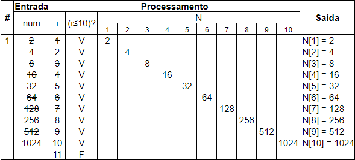

O Algoritmo Horas tem como funcionalidade armazenar as horas trabalhadas por dia do mês, em um vetor, e totalizar as horas do mês. Para isso, usa uma estrutura de repetição pré-teste para a inserção dos valores no vetor e uma estrutura contada (para-faça) para a totalização. Além disso, uma das informações de entrada é usada como índice do vetor, o que contribui para a compreensão do acesso a uma posição específica do vetor.

```
Algoritmo "Horas trabalhadas"
// Descrição: Armazena as horas trabalhadas por dia e  
//            totaliza as horas do mês
Var
   dia, horas, i : inteiro
   ht : vetor [1 .. 31] de inteiro
Inicio
   leia (dia)
   enquanto (dia <> 0) faca
        leia (horas)
        ht[dia] <- horas
        leia (dia)
   fimenquanto
   horas <- 0
   para i de 1 até 31 faca
        horas <- horas + ht[i]
   fimpara
   escreva (horas, " horas")
Fimalgoritmo
```

No teste de mesa, é possível identificar as duas estruturas de repetição distintas (uma para a entrada dos dados, outra para a totalização das horas). 

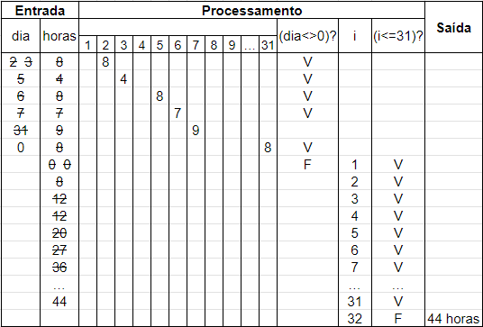


## Observações gerais
Em códigos mais extensos, o teste de mesa é restrito ao bloco de processamento destinado à resolução do problema.

Quando há inicialização de variáveis, em algoritmos com estruturas de repetição, sugere-se que a primeira linha do teste seja destinada aos valores iniciais, antes que uma instância de teste comece. 

Essas situações ocorrem em testes de algoritmos com vetor. Como o preenchimento do vetor pode ser considerado trivial, o teste deve se dedicar ao fragmento do algoritmo (ou função) que contém a lógica central do problema. A primeira linha do teste contém os valores armazenados no vetor, sobre os quais será verificada a funcionalidade.
